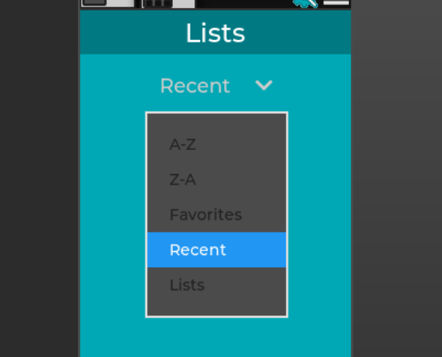

# User's Guide for Offline eBook Application

Welcome to the Offline eBook Application user's guide. This guide will help you get started with our application, allowing you to enjoy your favorite eBooks without an internet connection. Follow these steps to make the most of your reading experience.

Table of Contents

1. System Requirements
    - System Specs

2. Installation  
   - Runtime Dependencies
   - Testing Dependencies
   - Third Party Libraries
   - Installation Steps
   
   

3. Operation
    - Getting Started   
        - Opening the Application
        - Navigating the Library
   
   

    -  Reading eBooks
        - Opening an eBook
        - Page Navigation
   
   
   
    - Managing Your Library
        - Organizing eBooks
        - Deleting eBooks
   
   

    - Advanced Features
        - Searching for eBooks
        - Theme change
        - Grid view change
         - Sort A-Z or Z-A
   

4. Troubleshooting
   - Common Issues
   - Contact Support
   
   

5. Updates and Maintenance
   - Keeping the Application Up to Date
   - Regular Backups

6. Testing Framework
    - Setting up the Testing

## System Requirements

Before installing the Offline eBook Application, ensure that your device meets the following requirements:

- Operating System: 
  - Windows 10 
  - macOS 10.12 or later 
  - Linux (system-specific requirements may apply)
- Processor: 1 GHz or faster
- RAM: 2 GB or more
- Storage: 100 MB of available disk space

## Installation

### Runtime Dependencies
- [Poppler Library](https://poppler.freedesktop.org/)
  - A PDF Rendering Library based on xpdf-3.0 code base.

### Testing Dependencies
- [Catch2](https://github.com/catchorg/Catch2/tree/devel)
  - A modern, C++ native, test framework for unit-tests, TDD and BDD

### Third Party Libraries
- [json](https://github.com/nlohmann/json)
  - json for modern c++

### Installation Steps
- 
- 

## Operation

### Getting Started

1. Opening the Applicatiion
    - First click on the icon to launch the software
    - Once the software loads you will see your library with the eBooks you have already downloaded

2. Navigating the Library
    - On the top left hand side you will see an icon. 
    
    - Click this and it will open the left menu bar that will display active lists/favorites and other options.
    
    - The gear icon is a settings button what will open the options menu.
    
    - The final button is the collapse side menu button. This will close the side menu for better reading.
    

### Reading eBooks

1. Opening eBooks
    - To open an eBook, left click on an eBook you want and it will display the first page of said eBook.

2. Navigate eBooks 
    - Navigate by moving through each page. Scrolling up and down.

### Managing Your Library

1. Organizing eBooks
    - Right clicking on an eBook opens an option menu and allows one to add the eBook to favorites or create an entirely new List.
    - After adding eBooks to a list you can then sort your eBooks by lists in the left menu panel. 
    

2. Deleting an eBook
- Right click an eBook, select delete, then select confirm.

### Advanced Features

1. Search for eBooks
    - Click the search bar and type out the name or Author of the eBook. If there is an eBook that matches it will display in the eBook library area.

2. Theme Change
    - The top row will have multiple buttons in a row. The first on the left is a day/night toggle button to change the way the page is displayed from the default colors darker more easy on the eyes colors.
      - Light Theme
      
      - Dark Theme
       

3. Grid/List View Change
    - The next toggle button will change how the eBooks are displayed. From grid view to list view and back again.

4. Sort A-Z or Z-A
    - In the List part of the side bar there will be a drop down listing the current sort order
    
        - A-Z
        
        - Z-A
        
        - Favorites
        
        - Recent List
            - this is for the most recently used PDF's.
        
    - Selecting one of the options will organize and change the display accordingly

## Trouble Shooting

1. Common Issues
- 

2. Contact Support
- 

## Updating and Maintenance

1. Keeping the Application Up to Date
- 

2. Regular Backups
- 